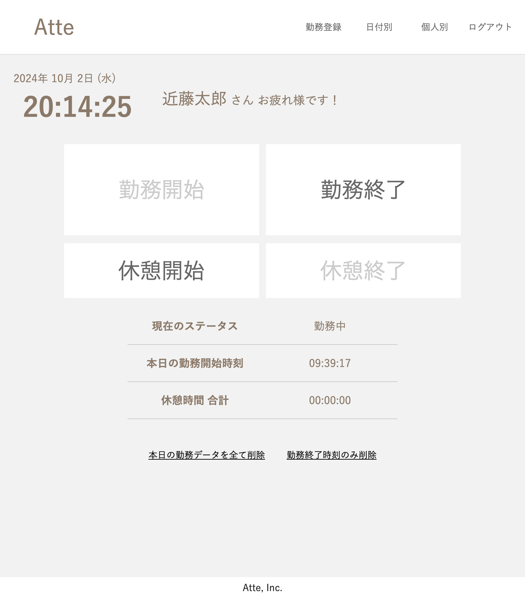
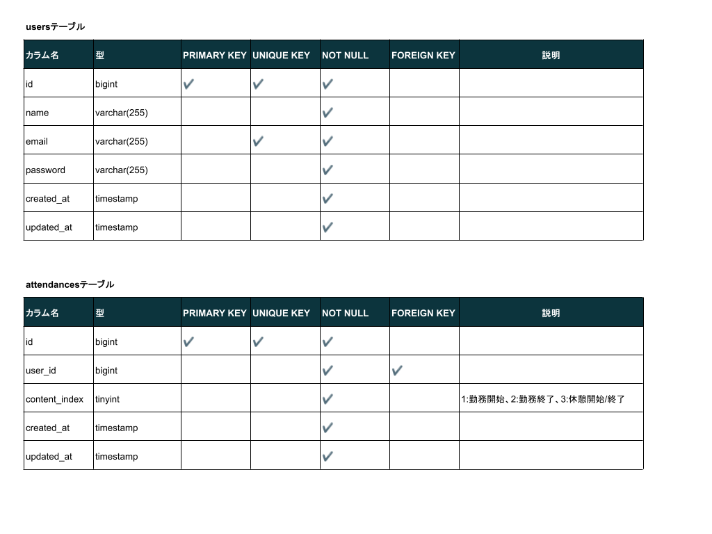
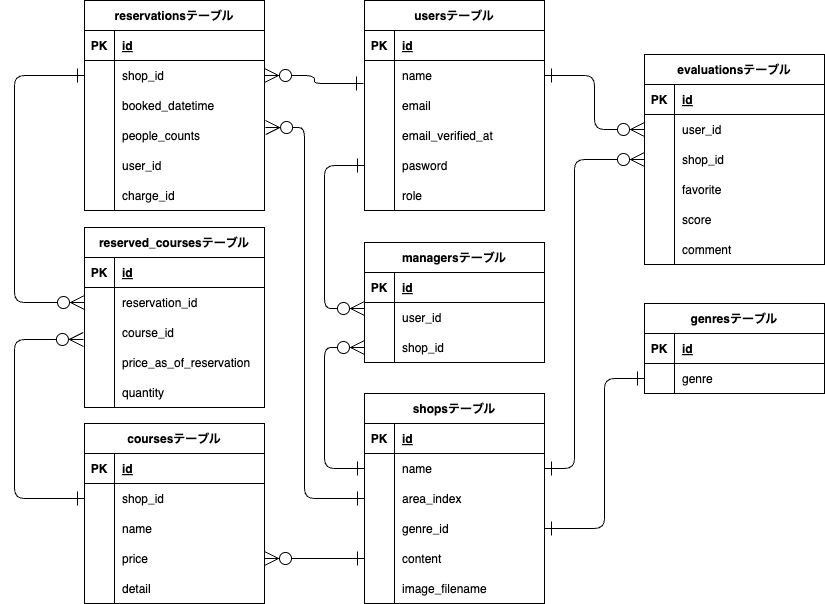

# 勤怠管理システム

勤怠データを記録するシステムです。


## 作成した目的

勤怠データの記録はとても面倒です。ストレスなく簡単にデータを記録できるシステムあると便利です。

## アプリケーションURL

- 開発環境：<http://localhost/>
- phpMyAdmin：<http://localhost:8080>

## 他のリポジトリ

なし

## 機能一覧

- 会員登録
- ログイン/ログアウト
- 勤務開始/勤務終了登録
- 休憩開始/休憩終了登録
- 日付別勤怠情報表示(ページネーション: 5件ずつ)
- 会員別勤怠情報表示(ページネーション: 7件ずつ)

## 使用技術(実行環境)

- PHP 8.3.10
- Laravel 8.83.8
- MySQL 8.0.26

## テーブル設計



## ER図



## 環境構築

Dockerビルド

1. `git clone <git@github.com>:TakaharaYuichiro/atte-yt.git`
2. DockerDesktopアプリを立ち上げる
3. `docker-compose up -d --build`

> *MacのM1・M2チップのPCの場合、`no matching manifest for linux/arm64/v8 in the manifest list entries`のメッセージが表示されビルドができないことがあります。
エラーが発生する場合は、docker-compose.ymlファイルの「mysql」内に「platform」の項目を追加で記載してください*

``` bash
mysql:
    platform: linux/x86_64(この文追加)
    image: mysql:8.0.26
    environment:
```

Laravel環境構築

1. `docker-compose exec php bash`
2. `composer install`
3. 「.env.example」ファイルを 「.env」ファイルに命名を変更。または、新しく.envファイルを作成
4. .envに以下の環境変数を追加

``` text
DB_CONNECTION=mysql
DB_HOST=mysql
DB_PORT=3306
DB_DATABASE=laravel_db
DB_USERNAME=laravel_user
DB_PASSWORD=laravel_pass
```

5. アプリケーションキーの作成

``` bash
php artisan key:generate
```

6. マイグレーションの実行

``` bash
php artisan migrate
```

7. シーディングの実行

``` bash
php artisan db:seed
```

## 備考


