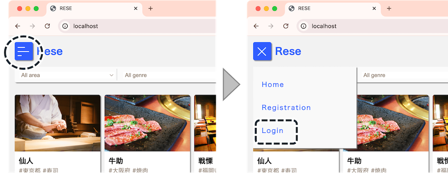
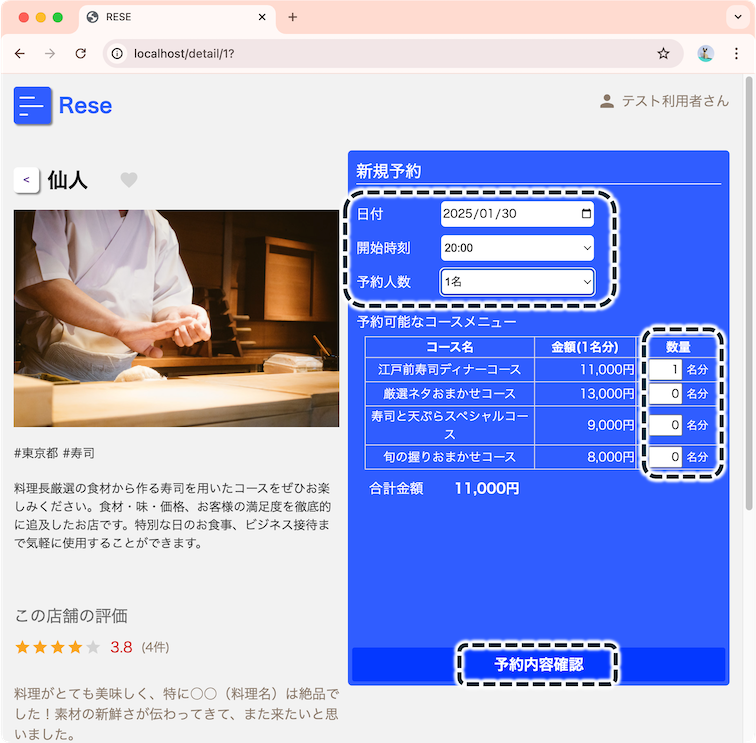
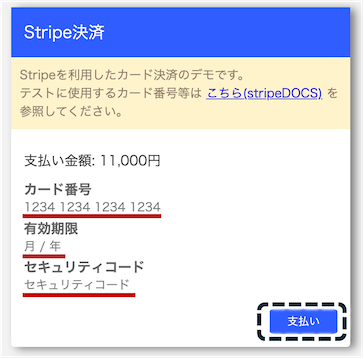
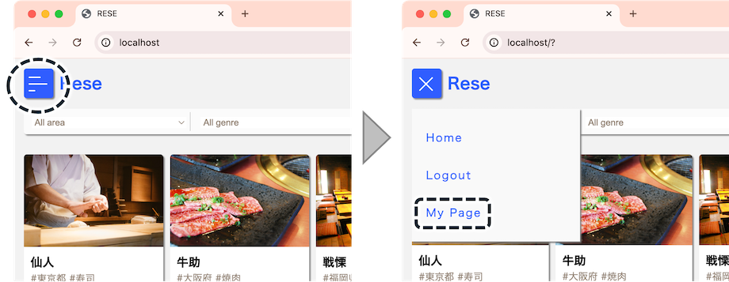
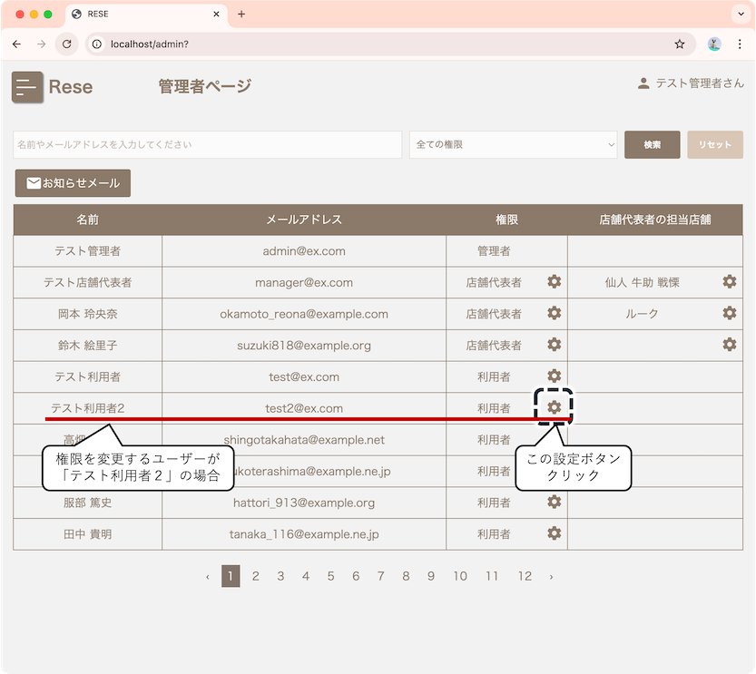
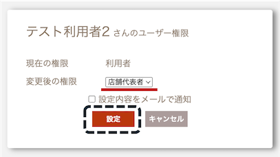
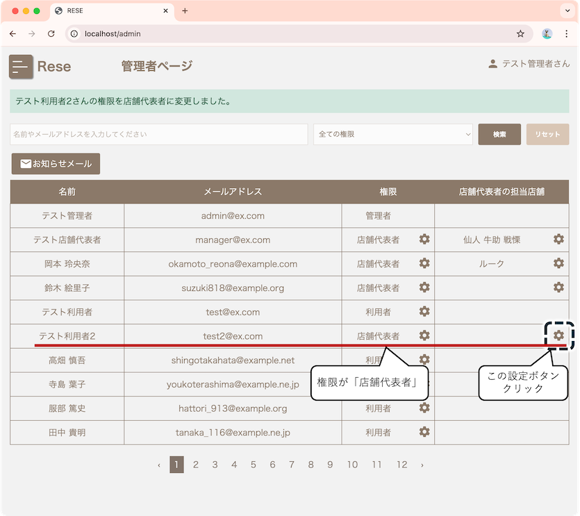
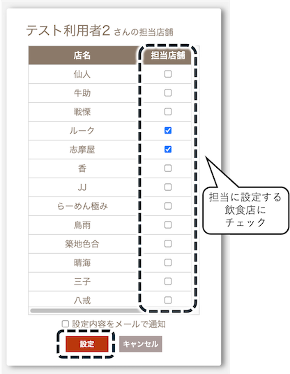
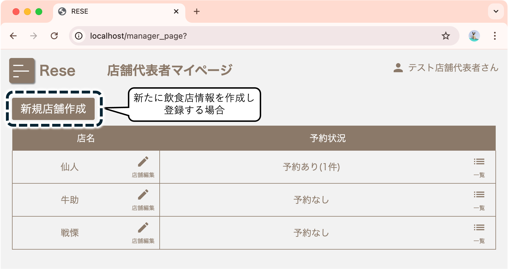

# 飲食店予約システム Rese(リーズ)

ある企業のグループ会社の飲食店予約サービス用のシステムです。

||
|:-:|

## 作成した目的

外部の飲食店予約サービスは手数料を支払う必要があります。自社で予約サービスを持つことでコストダウンを図ります。

## アプリケーションURL

- 開発環境：<http://localhost/>
- phpMyAdmin：<http://localhost:8080>
- MailHog：<http://localhost:8025> (ブラウザからMailHog管理画面にアクセスするためのURL)

## 動作検証に必要なサイト

- Stripe：<https://stripe.com/>
飲食店予約時の料金のカード決済のデモに使用します。
Stripe公式サイトにて、ユーザー登録と、APIキーの取得を行ってください。

## 他のリポジトリ

なし

## 機能一覧

### 基本機能

- 会員登録 (MailHogを利用した擬似的なメール認証機能付き)
- ログイン/ログアウト
- ユーザー情報取得
- 飲食店お気に入り一覧取得
- 飲食店予約情報取得
- 飲食店一覧取得
- 飲食店詳細取得
- 飲食店お気に入り追加
- 飲食店お気に入り削除
- 飲食店予約情報追加
- 飲食店予約情報削除
- エリアで飲食店検索
- ジャンルで飲食店検索
- 店名/概要で飲食店のキーワード検索

### 追加実装機能

- 飲食店予約変更機能
- 飲食店評価機能
- 認証、予約時のバリデーション
- レスポンシブデザイン(ブレイクポイント768px)
- 管理画面(管理者向け、店舗代表者向け)
- 飲食店の画像をストレージに保存
- メールによる本人確認
- 管理画面から利用者にお知らせメール送信
- 予約当日の朝に予約情報のリマインダーメール送信
- 飲食店予約時の確認メールにQRコード表示
- Stripeを利用した決済機能

## 使用技術(実行環境)

- PHP 8.3.10
- Laravel 8.83.8
- MySQL 8.0.26
  
## テーブル設計

**usersテーブル**：管理者、店舗代表者を含むユーザー情報を記録するテーブル


**shopsテーブル**：飲食店情報を記録するテーブル


**managersテーブル**：店舗代表者のユーザーID(user_id)と、その店舗代表者が担当する飲食店ID(shop_id)を記録するテーブル


**evaluationsテーブル**：お気に入り登録と評価機能に関するテーブル


**genresテーブル**：飲食店のジャンルを記録するテーブル


**reservations**テーブル：予約機能に関するテーブル


**coursesテーブル**：予約機能の付加機能として追加したコースメニュー(※)の情報を記録するためのテーブル

(※)コースメニュー：ここでは飲食店ごとに設定できる料理の品目を表す。Stripe決済の際に金額の入力が必要なため、コースメニューの予約内容に応じた金額を使用することにした。

**reserved_corsesテーブル**：予約されたコースメニューの内容(単価、数量)を記録するためのテーブル


## ER図


(※)各テーブルのカラム名において、"created_at"、"updated_at"の記載を省略した。

## 環境構築

### Dockerビルド

1. githubからcloneを作成

``` bash
git clone git@github.com:TakaharaYuichiro/rese-yt.git
```

2. DockerDesktopアプリを立ち上げる

3. Dockerの設定

``` bash
docker-compose up -d --build
```

> MacのM1・M2チップのPCの場合、`no matching manifest for linux/arm64/v8 in the manifest list entries`のメッセージが表示されビルドができないことがあります。
エラーが発生する場合は、docker-compose.ymlファイルの「mysql」内に「platform」の項目を追加で記載してください*

``` bash
mysql:
    platform: linux/x86_64(この文追加)
    image: mysql:8.0.26
    environment:
```

### Laravel環境構築

1. PHPコンテナにログイン

``` bash
docker-compose exec php bash
``` 

2. パッケージをインストール

``` bash
composer install
```

3. 「.env.example」ファイルをコピーし「.env」に名称を変更。または、新しく.envファイルを作成
4. .envファイル内の以下の環境変数を、以下のとおり変更もしくは追加

``` text
DB_CONNECTION=mysql
DB_HOST=mysql
DB_PORT=3306
DB_DATABASE=laravel_db
DB_USERNAME=laravel_user
DB_PASSWORD=laravel_pass

MAIL_MAILER=smtp
MAIL_HOST=mailhog
MAIL_PORT=1025
MAIL_USERNAME=null
MAIL_PASSWORD=null
MAIL_ENCRYPTION=null
MAIL_FROM_ADDRESS="test_mail@ex.com"  # MailHog送信テスト用
MAIL_FROM_NAME="${APP_NAME}"

# Stripe APIキー(※)
STRIPE_PUBLIC_KEY=pk_test_xxxxxxxxxxxxxxxxxxx
STRIPE_SECRET_KEY=sk_test_xxxxxxxxxxxxxxxxxxx
```

> (※)Stripe APIキーは、Stripeの公式サイト(<https://stripe.com/>)の開発者ページにて公開可能キーとシークレットキーを取得して、.envファイルに記載してください。

5. アプリケーションキーの作成

``` bash
php artisan key:generate
```

6. マイグレーションの実行

``` bash
php artisan migrate
```

7. シーディングの実行

``` bash
php artisan db:seed
```

## 動作検証方法

### テスト用アカウント

シーディングにより、以下のテスト用アカウントが登録されています。

|権限|Email|Password|
|:---|:---|:---|
|管理者|admin@ex.com|test_pw1234|
|店舗代表者|manager@ex.com|test_pw1234|
|利用者|test@ex.com|test_pw1234|
|利用者|test2@ex.com|test_pw1234|

### アプリ起動、ログイン

1. ブラウザでlocalhostにアクセスし、Reseアプリを起動してください。
2. 画面左上のハンバーガーメニューから「Login」をクリックしてください。

3. Login画面で、前項に記載のいずれかのテスト用アカウントのEmailとPasswordを入力し、「ログイン」ボタンをクリックしてください。

### 上記以外のアカウントの登録方法

上記のテスト用アカウント以外でテストする場合は、以下の方法により会員登録してアカウントを新規作成してください。

1. すでに他のユーザーでログインしている場合は、画面左上のハンバーガーメニューから「Logout」をクリックし、一旦ログアウトしてください。
2. ハンバーガーメニューから「Registration」をクリックしてください。

3. 会員登録画面でテスト用の名前とメールアドレス、パスワードを入力してください (テスト用のため、メールアドレスは適当な内容でかまいません)。
4. 同じく会員登録画面で「会員登録」のボタンをクリックすると、MailHogに確認メールが送信されます (この時点では会員登録は終了していません)。
5. ブラウザで別のタブを開き、localhost:8025にアクセスして、MailHogを起動してください。
6. MailHogに届いた「【Rese】メールアドレスの確認確認」のメールを開き、メールに記載されているURLリンクをクリックしてください。
7. 会員登録が完了するとReseアプリにログインできます。

> この方法で作成したユーザーの権限は「利用者」となります。権限を変更する方法は「権限の変更方法」の項を参照してください。

### 予約および決済(Stripe)の方法

ここでは、飲食店を予約し、Stripeの決済機能によりカード決済を行う方法の例を示します。Stripe決済機能を使用するため、事前にStripeのユーザー登録と、.envへのStripe APIキーの記載(Laravel環境構築の項参照)を行ってください。

1. 飲食店一覧画面(ホーム画面)に表示されている飲食店のなかから、「仙人」「牛助」「戦慄」(※)のいずれかの「詳しく見る」ボタンをクリックして、飲食店詳細/新規予約画面に進んでください。


> (※)Stripe決済の実行の際には、1円以上の決済金額の入力が必要です。本アプリにおいては、「コースメニュー予約機能」を追加し、コースメニューに金額を設定することでこれを実現しています。
> 　このため、Stripe決済の動作テストのためには「コースメニュー」が1つ以上登録されている飲食店で予約する必要があります。「仙人」「牛助」「戦慄」の3店には、シーディングによりあらかじめコースメニューが登録されています。
> 　なお、これら3店以外にコースメニューを登録するためには、店舗代表者アカウントでログインしたのち、店舗代表者マイページから各飲食店の情報を編集してコースメニューを登録しておく必要があります。

2. 新規予約の欄にある「予約可能なコースメニュー」の中のいずれかの数量を1以上にしたうえで、「予約内容確認」をクリックしてください。

3. 予約内容確認画面で「この内容で予約する」 → 「支払いへ」とクリックして、Stripe決済のカード入力画面に進んでください。
4. Stripe決済のダイアログでテスト用のカード情報(※)を入力のうえ、「支払い」をクリックしてください。


> (※)テスト用のカード情報については、以下のStripe公式サイトに記載の情報を利用してください。
> Stripe DOCS「テストカードの使用方法」: <https://docs.stripe.com/testing?locale=ja-JP/>

### 予約の変更・取り消しについて

予約を変更もしくは取り消しする方法は以下のとおりです。

1. 画面左上のハンバーガーメニューから「My Page」をクリックしてください。

2. 予約状況の項目に表示されている対象の予約の「変更」ボタンをクリックしてください。

3. ①予約を変更する場合は、変更後の予約内容の欄に必要事項を記入のうえ、「変更内容確認」をクリックしてください。②予約を取り消す場合は「この予約を削除」をクリックしてください。


> 変更・取り消しができるのは、明日以降の予約のみです。本日分の予約は変更・取り消しができない仕様としています。

### 権限の変更方法 (※管理者権限必要)

ユーザーの権限を変更するには、管理者アカウントでログインする必要があります。以下の方法で管理者としてログインし、対象のユーザーの権限を変更してください。

1. 管理者以外の権限のアカウントで既にログインしている場合は、画面左上のハンバーガーメニューから「Logout」をクリックして、一旦ログアウトしてください。
2. ハンバーガーメニューから「Login」をクリックしてください。
3. Login画面で、管理者アカウントのEmailとPasswordを入力し、「ログイン」ボタンをクリックしてください。
4. ハンバーガーメニューから「管理者ページ」をクリックしてください。

5. 権限を変更する対象のユーザーの「権限」列にある設定ボタンをクリックしてください。対象ユーザーが表示されていない場合は、ページを変更するか、画面上部の検索バーを利用して、対象のユーザーを検索してください。

6. 権限変更ダイアログにて、「変更後の権限」を選択のうえ、「設定」をクリックしてください。


### 登録済みの飲食店への店舗代表者割り当て (※管理者権限必要)

飲食店の情報(店名、写真など)の編集は、その飲食店に担当として割り当てられている店舗代表者が実施できます。従って、すでに登録されている飲食店の情報を編集する場合は、事前に、その飲食店に店舗代表者を割り当てておく必要があります。店舗代表者の割り当てには管理者権限が必要です。以下に、管理者アカウントでログインし、飲食店に店舗代表者を割り当てる方法を示します。

1. 管理者以外の権限のアカウントで既にログインしている場合は、画面左上のハンバーガーメニューから「Logout」をクリックし、一旦ログアウトしてください。
2. ハンバーガーメニューから「Login」をクリックしてください。
3. Login画面で、管理者アカウントのEmailとPasswordを入力し、「ログイン」ボタンをクリックしてください。
4. ハンバーガーメニューから「管理者ページ」をクリックしてください。

5. 対象の店舗代表者の「店舗代表者の担当店舗」列にある設定ボタンをクリックしてください。対象の店舗代表者が表示されていない場合は、ページを変更するか、画面上部の検索バーを利用して検索してください。

6. 担当店舗変更ダイアログにて、この店舗代表者に割り当てる飲食店のチェックボックスにチェックを入れたうえで「設定」をクリックしてください。


### 飲食店情報の編集/新規登録/予約状況確認方法 (※店舗代表者権限必要)

店舗代表者は、担当として割り当てられている飲食店の情報を編集することができます。また、新たな飲食店を新規作成して登録することができます。さらに、飲食店の予約状況を確認することができます。以下の方法で店舗代表者アカウントでログインし、店舗代表者マイページから各々の操作を実行してください。

1. 店舗代表者以外の権限のアカウントで既にログインしている場合は、画面左上のハンバーガーメニューから「Logout」をクリックしてください。
2. ハンバーガーメニューから「Login」をクリックしてください。
3. Login画面で、店舗代表者アカウントのEmailとPasswordを入力し、「ログイン」ボタンをクリックしてください。
4. ハンバーガーメニューから「店舗代表者ページ」をクリックしてください。

5. 【編集】すでに登録されている飲食店の情報を編集する場合は、店舗代表者マイページにて対象の飲食店の「店舗編集」をクリックしてください。店舗情報編集画面にて必要事項を記入のうえ「店舗情報を更新」をクリックしてください。


6. 【新規登録】飲食店情報を新たに作成する場合は、店舗代表者マイページにて「新規登録」をクリックしてください。新規店舗作成画面にて必要事項を記入のうえ「この内容で新規登録」をクリックしてください。


7. 【予約状況】飲食店の予約状況を確認する場合は、店舗代表者マイページにて「一覧」をクリックしてください。


以上